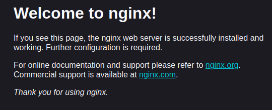

# Web application
```
http://pigalicza.abrdns.com
```
## Usefull commands

Resurses monitor
```
htop
```

Memory monitor
```
free -h
```

Swap (размером 2 ГБ c автоматическим включением)
```
dd if=/dev/zero of=/swapfile bs=1M count=2048
chmod 600 /swapfile
mkswap /swapfile
swapon /swapfile
echo '/swapfile none swap sw 0 0' >> /etc/fstab
```

Activate MySQL

```
sudo mysql
```

Change database
```
USE pigalicza_db
```

View tables in database
```
SHOW TABLES
```
```
DESCRIBE visits
```

Close MySQL
```
EXIT
```

Save file in nano
```
Ctr + o
```
Service existing

```
sudo systemctl status cpp-backend.service
```
View web-server errors
```
sudo tail -f /var/log/nginx/error.log
```
Check Nginx

```
sudo nginx -t
```
Reload Nginx
```
sudo systemctl reload nginx
```


## (0) Server structure

```
Браузер (JS-фронтенд)
  ↓ HTTP/HTTPS-запросы
NGINX (прослушивает порты 80/443)
  ├── если запрос к статике (HTML, CSS, JS, картинки) → nginx отдаёт файл сам (очень быстро)
  └── если запрос к API (/api/...) → nginx перенаправляет (проксирует) запрос на C++ бэкенд
       ↓
    C++ бэкенд (слушает localhost:8080, например)
       ↓
    MySQL через Connector/C++
```

<div style="line-height: 0.5;">
<span style="color: gray;">

Фронтенд (JS): Пользователь заходит на ваш сайт, и JavaScript в браузере отправляет запросы к API

Nginx: Принимает все входящие запросы. Если запрос к API (начинается с /api/), он передаёт его C++ бэкенду. Если запрос к обычной странице

(index.html, стили и т.д.), Nginx отдаёт статические файлы напрямую.

C++ (Crow): Бэкенд-сервер обрабатывает API-запросы.

MySQL Connector/C++: Библиотека, которая позволяет C++ коду общаться с базой данных MySQL.

MySQL: База данных хранит информацию приложения, например, записи о посещениях.
</span>
</div>


<!-- <p align="center">
  
</p> -->


## (1) connection to the server

```
ssh root@31.56.196.252
```

<div style="line-height: 0.5;">
<span style="color: gray;">

The authenticity of host '31.56.196.252 (31.56.196.252)' can't be established.

ED25519 key fingerprint is SHA256:W9pZMVa5e8ySTRSeGaIpiWHokIKsZXhBkWc6m3XFmQg.

This key is not known by any other names.

Are you sure you want to continue connecting (yes/no/[fingerprint])? yes

Warning: Permanently added '31.56.196.252' (ED25519) to the list of known hosts.

root@31.56.196.252's password: 

</span>
</div>


## (2) Installation Nginx (Web-server), CMake, MySQL

### Nginx:

```
apt update && apt upgrade -y
```

```
apt install nginx -y
```

Checking the correct installation in browser:
```
http://31.56.196.252
```

<p align="center">
  
</p>

### CMake:

```
sudo apt install -y build-essential cmake git
```

### MySQL:

Установка сервера MySQL
```
sudo apt install -y mysql-server
```

Запуск и добавление в автозагрузку
```
sudo systemctl start mysql
sudo systemctl enable mysql
```

Безопасная настройка MySQL (установите пароль root, удалите тестовые БД и т.д.)
```
sudo mysql_secure_installation
```

После настройки MySQL нужно создать пользователя и базу данных

```
sudo mysql
```
```
CREATE DATABASE pigalicza_db;
CREATE USER 'my_user'@'localhost' IDENTIFIED BY 'aboba123';
GRANT ALL PRIVILEGES ON pigalicza_db.* TO 'my_user'@'localhost';
FLUSH PRIVILEGES;
```

Создаем таблицу посещений
```
USE pigalicza_db;
CREATE TABLE visits (
    id INT AUTO_INCREMENT PRIMARY KEY,
    ip_address VARCHAR(45) NOT NULL,
    visit_time TIMESTAMP DEFAULT CURRENT_TIMESTAMP
);
EXIT;
```


### Библиотеки C++:

Заголовочные файлы и библиотека Boost
```
sudo apt install -y libboost-all-dev
```
```
sudo apt install -y libasio-dev libssl-dev
```

Библиотеки для SSL и ASIO (требуются Crow)
```
sudo apt install -y libssl-dev libasio-dev
```

Библиотека для работы с MySQL из C++
```
sudo apt install -y libmysqlcppconn-dev
```

Библиотека для работы с json
```
sudo apt install -y nlohmann-json3-dev
```

### Crow:

Клонируем репозиторий с кодом Crow
```
git clone https://github.com/CrowCpp/Crow.git
cd Crow
```
Создаем папку для сборки
```
mkdir build && cd build
```
Настраиваем сборку и собираем библиотеку
```
cmake .. -DCROW_BUILD_EXAMPLES=OFF -DCROW_BUILD_TESTS=OFF
make -j$(nproc)
```
Устанавливаем библиотеку в систему
```
sudo make install
```

## Code

### C++

```
cd ~
mkdir my_cpp_app
```

```
nano ~/my_cpp_app/main.cpp
```

<div style="line-height: 0.5;">
<span style="color: gray;">

Содержимое main.cpp ...

</span>
</div>

```
cd ~/my_cpp_app
g++ -std=c++17 -o my_server main.cpp -I/usr/local/include -lmysqlcppconn -lpthread -lssl -lcrypto -lboost_system
```

```
./my_server
```

### Nginx

Выполните
```
nano /etc/nginx/sites-available/mysite
```
<div style="line-height: 0.5;">
<span style="color: gray;">

Содержимое mysite ...

</span>
</div>

Активируйте конфигурацию и перезагрузите Nginx

```
sudo ln -s /etc/nginx/sites-available/mysite /etc/nginx/sites-enabled/
sudo rm /etc/nginx/sites-enabled/default
sudo nginx -t
sudo systemctl restart nginx
```

### JS

```
sudo mkdir -p /var/www/mysite
sudo nano /var/www/mysite/index.html
```
<div style="line-height: 0.5;">
<span style="color: gray;">

Содержимое jshtml ...

</span>
</div>

### Автозапуск (сервис для автозапуска)

```
sudo nano /etc/systemd/system/cpp-backend.service
```
<div style="line-height: 0.5;">
<span style="color: gray;">

Содержимое service ...

</span>
</div>

Включите и запустите сервис

```
sudo systemctl daemon-reload
sudo systemctl enable cpp-backend.service
sudo systemctl start cpp-backend.service
```

<!-- ## SSL-sertificate

```
sudo apt install certbot python3-certbot-nginx -y
```
```
sudo certbot --nginx -d pigalica.abrdns.com -d www.pigalica.abrdns.com
``` -->
