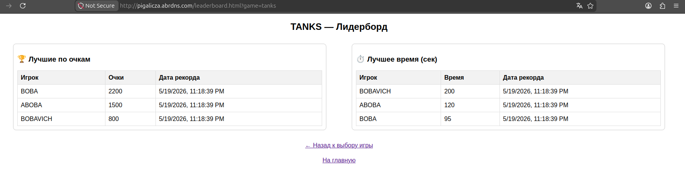

# Creating records table

## MySQL

```
sudo mysql
USE pigalicza_db
```
```
CREATE TABLE tanks_records(
    user_id INT PRIMARY KEY,
    score INT NOT NULL DEFAULT 0,
    time INT NOT NULL DEFAULT 0,
    created_at TIMESTAMP DEFAULT CURRENT_TIMESTAMP,
    FOREIGN KEY (user_id) REFERENCES users(id)
);
```

```
CREATE TABLE races_records(
    user_id INT PRIMARY KEY,
    score INT NOT NULL DEFAULT 0,
    time INT NOT NULL DEFAULT 0,
    created_at TIMESTAMP DEFAULT CURRENT_TIMESTAMP,
    FOREIGN KEY (user_id) REFERENCES users(id)
);
```

```
ALTER TABLE users 
ADD COLUMN verification_code VARCHAR(10) NOT NULL DEFAULT '';
```

## C++

```
cd ~/my_cpp_app
```
```
nano main.cpp
```
```
nano functions.h
```
```
nano functions.cpp
```
```
nano database.h
```
```
nano database.cpp
```
```
sudo systemctl restart cpp-backend.service
```

## JS

```
nano /var/www/mysite/index.html
```
```
nano /var/www/mysite/register.html
```
```
nano /var/www/mysite/login.html
```
```
nano /var/www/mysite/profile.html
```
```
nano /var/www/mysite/leaderboard_choice.html
```
```
nano /var/www/mysite/leaderboard.html
```
<p align="center">
  
</p>
<p align="center">
  
</p>
<p align="center">
  
</p>