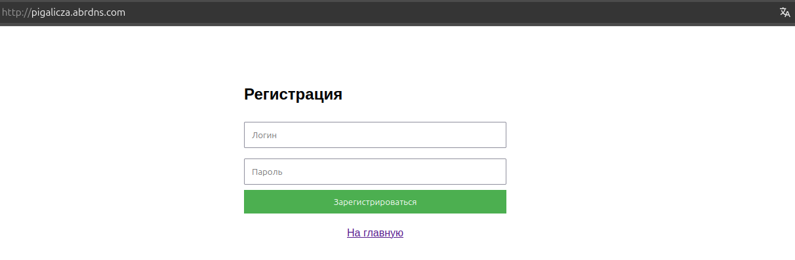
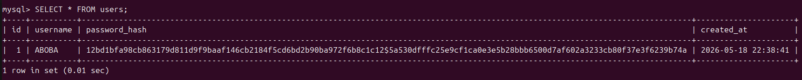

# Web authentication

## MySQL

After connecting to the server:
```
sudo mysql
```

```
USE pigalicza_db;
CREATE TABLE users (
    id INT AUTO_INCREMENT PRIMARY KEY,
    username VARCHAR(50) NOT NULL UNIQUE,
    password_hash VARCHAR(255) NOT NULL,
    created_at TIMESTAMP DEFAULT CURRENT_TIMESTAMP
);
```

## C++

Вставьте в файл my_cpp_app содержимое файла из дирректории, затем ...

```
cd ~/my_cpp_app
g++ -std=c++17 -o my_server main.cpp -I/usr/local/include -lmysqlcppconn -lpthread -lssl -lcrypto -lboost_system
```

```
sudo systemctl restart cpp-backend.service
```

## JS

```
nano /var/www/mysite/index.html
```

Вставьте соджержимое файла из дирректории.

Затем перейдите на сайт и зарегистрируйтесь.

<p align="center">
  
</p>


<p align="center">
  
</p>

