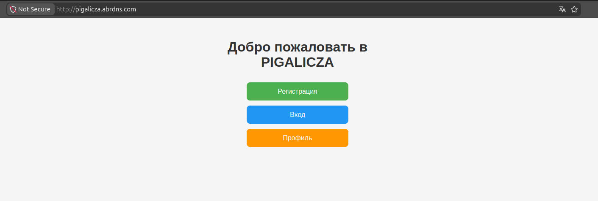
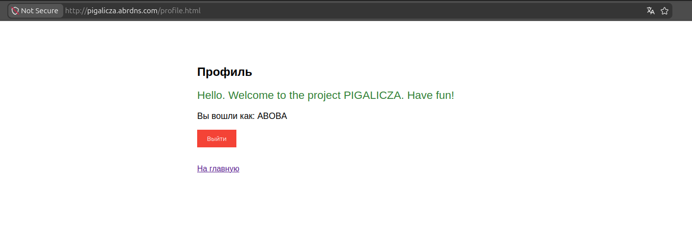

# LohIN and LogOUT

## MySQL
```
sudo mysql
```
```
USE pigalicza_db;
CREATE TABLE sessions (
    session_id VARCHAR(64) PRIMARY KEY,
    user_id INT NOT NULL,
    created_at TIMESTAMP DEFAULT CURRENT_TIMESTAMP,
    expires_at TIMESTAMP,
    FOREIGN KEY (user_id) REFERENCES users(id) ON DELETE CASCADE
);
```

## C++

Вставьте в my_cpp_app содержимое из дирректории

```
cd ~/my_cpp_app
g++ -std=c++17 -o my_server main.cpp -I/usr/local/include -lmysqlcppconn -lpthread -lssl -lcrypto -lboost_system
```
```
sudo systemctl restart cpp-backend.service
```

## JS

```
touch /var/www/mysite/register.html
```
```
touch /var/www/mysite/login.html
```
```
touch /var/www/mysite/profile.html
```
Измените сожержимое всех страниц: index.html login.html profile.html

<p align="center">
  
</p>

<p align="center">
  
</p>