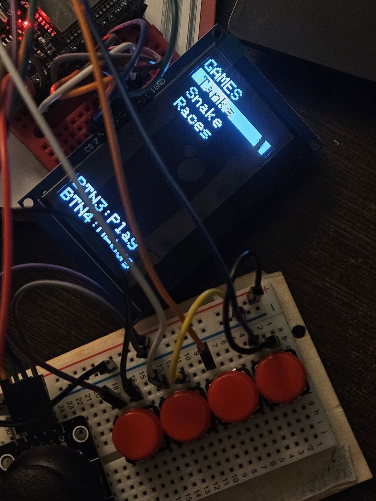
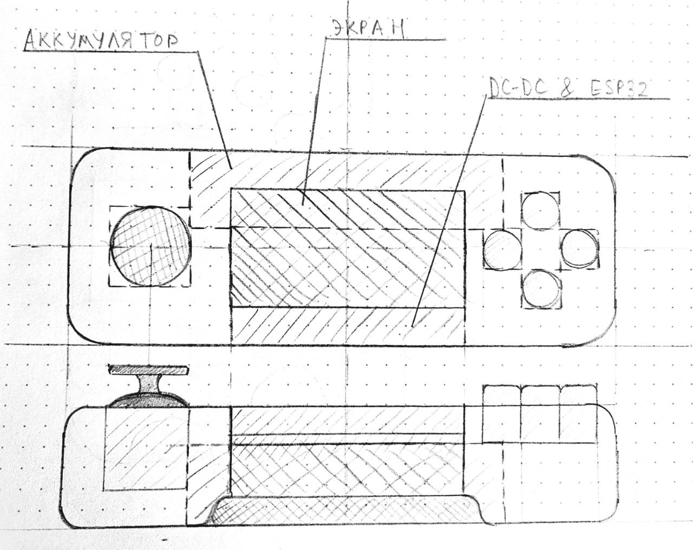
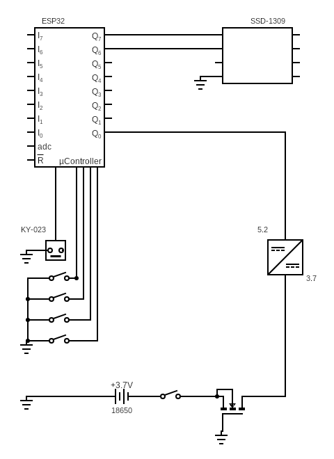
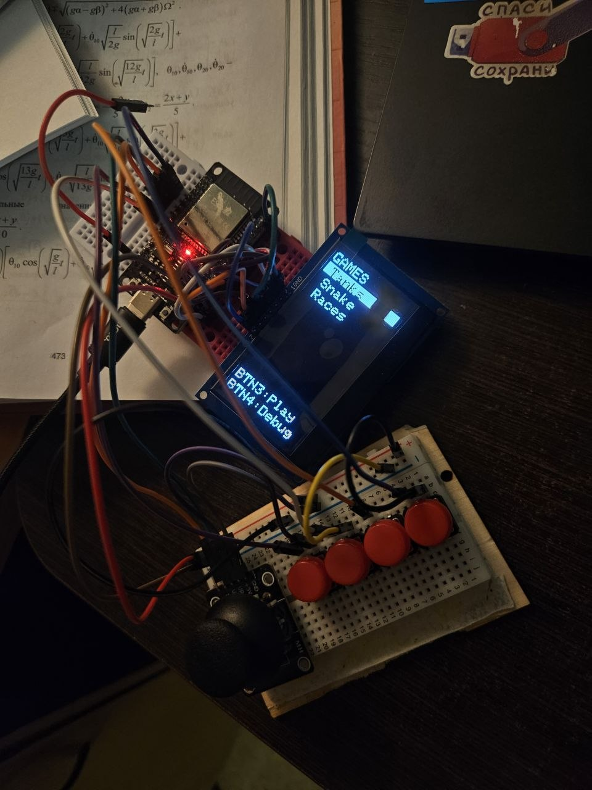

# PIGALICZA 
## ESP32-Tetris Console | Портативная игровая консоль

**Текущий статус:** Разработка аппаратной части завершена. Ключевые объекты графического ядра реализованы и проверены в тестовых сценариях. Ведется разработка игр и интеграция сети.

<!-- 

 -->

>

---

## 1. Аннотация

Данный проект представляет собой реализацию портативной консоли, которая изначально разрабатывается как клиентская часть игровой системы.

ESP32 выступает в роли центрального процессора, управляет дисплеем, обрабатывает ввод пользователя. Архитектура кода построена на принципах объектно-ориентированного программирования, что дает возможности легкого расширения функций консоли (большее количество игр, улучшение взаимодействия с базой пользователей).

---

## 2. Цели проекта

### 2.1. Инженерные цели
*   **Аппаратная реализация:** Создание автономного устройства питающегося от легкозаменимого источника питания.
*   **Программная архитектура:** Разработка модульного кода на C++, позволяющего масштабировать функционал.
*   **Сетевая интеграция:** Реализация подключения к серверу баз данных для аутентификации пользователей.
сервере.
*   **\*** Портирование Doom(1993)

### 2.2. Пользовательские цели
*   Создание полноценной ретро-консоли.
*   Обеспечение возможности сохранения игрового прогресса и статистики на удаленном сервере.

---

## 3. Используемые ресурсы

### 3.1. Аппаратное обеспечение (Hardware)

| Компонент | Модель | Назначение |
| :--- | :--- | :--- |
| **Микроконтроллер** | ESP-32 | Основной процессор, управление Wi-Fi, обработка ввода/вывода. |
| **Дисплей** | SSD1309 (128x64, SPI) | Вывод графики. Используется библиотека `Adafruit_GFX` для рендеринга. |
| **Орган управления** | KY-023 (Joystick) | Аналоговый джойстик для навигации по меню и управления игрой|
| **Питание** | 18650 (3.7V Li-Ion) | Основной источник энергии. |
| **Преобразователь** | DC-DC (3.7V → 5.0V) | Повышение напряжения для стабильной работы ESP32 и дисплея. |
| **Транзистор** | N-Channel MOSFET | Защита от переполюсовки схемы |

### 3.2. Программное обеспечение

*   **Библиотеки:**
    *   `Adafruit_GFX.h` — Графический примитив (точки, линии, шрифты).
    *   `Adafruit_SSD1306.h` — Драйвер для управления дисплеем SSD1306/SSD1309.
    *   `WiFi.h` — Управление сетевыми подключениями.

---

## 4. Прогресс

На данный момент проект находится в фазе **активной разработки**. Пройдены следующие этапы:

### 4.1. Аппаратная часть
*   [x] Разработана и собрана электрическая схема.
*   [ ] Разработка и изготовление корпуса (3D-печать).

### 4.2. Программная часть
*   [x] Реализован вывод на экран тестовых окон.
*   [x] Создана навигационная система: переключение между окнами.
*   [ ] Разработан пакет игр.

### 4.3. Сетевая часть
*   [ ] Подключение к Wi-Fi сетям с сохранением учетных данных.
*   [ ] Реализация запросов к серверу.
*   [ ] Система аутентификации (логин/пароль) на консоли.

---

Эскиз внешнего вида консоли

Электронная схема

